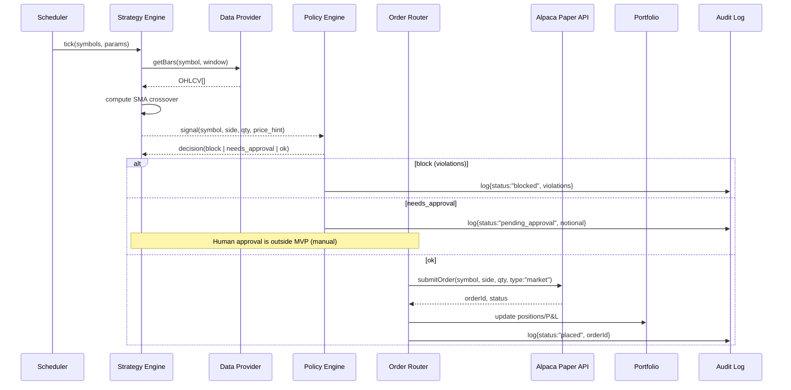
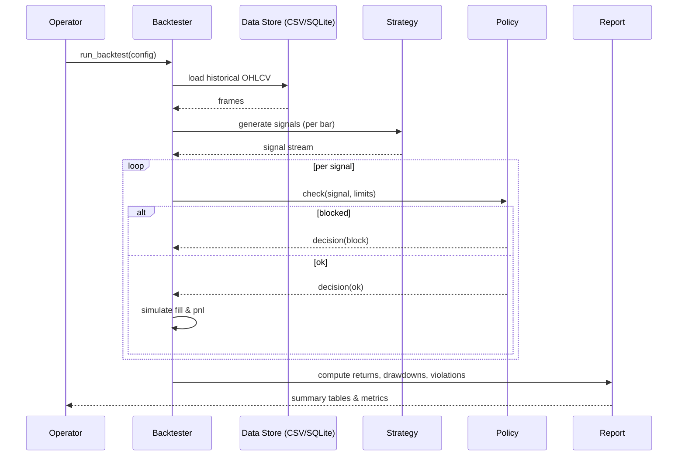
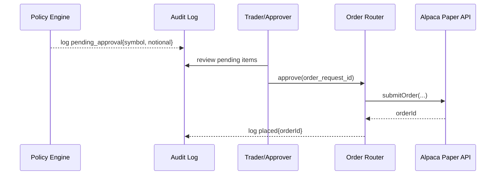

# Algo Trading Bot MVP — Product Requirements Document (PRD)

## 1. Purpose

Build a **guard-railed algo trading bot MVP** that demonstrates:

- Automated signal generation (rules-based + optional LLM advisory)
- Paper trading via **Alpaca’s paper API**
- Enforced **risk & compliance policies** before any trade
- Logging, monitoring, and auditability
- A simple backtesting engine to validate strategies

This MVP provides a safe, auditable environment to validate strategies, policies, and operational readiness **before live trading**.

---

## 2. Goals & Success Criteria

**Goals**

- Enable fully automated **paper trading** with Alpaca.
- Prove safety via a **Policy Engine**: no orders bypass limits.
- Provide **basic strategy hooks**: simple moving average (SMA) crossover.
- Run **backtests** against historical data.
- Produce **audit logs** for every decision.
- Deployable via **Docker Compose** with update scripts.

**Success Criteria**

- Bot can run unattended for 2 weeks in paper mode without policy violations.
- Logs capture 100% of decisions (signal → policy → order).
- Backtests reproducible and outperform SPY baseline in at least one test.
- Non-technical user can configure limits & strategies via `.env` or YAML.

---

## 3. Scope

### In Scope (MVP)

1. **Data ingestion**

   - Market data from Alpaca API.
   - Store OHLCV locally (SQLite or CSV).

2. **Strategies**

   - One **deterministic rules-based strategy** (SMA crossover).
   - Optional: **LLM Advisor** that generates natural-language “rationale” only (no direct trading power).

3. **Policy Engine**

   - Enforce limits:
     - Max position per symbol
     - Max gross notional
     - Daily max drawdown
     - Human approval threshold
   - Block or mark orders as `needs_approval`.

4. **Execution**

   - Place paper trades via Alpaca’s order API.
   - Order Router integrates with Policy Engine.

5. **Backtester**

   - Input: CSV/SQLite historical prices.
   - Run strategy logic + policy checks.
   - Output: returns, drawdowns, violation counts.

6. **Observability**

   - Structured logs (JSON).
   - Audit file of all trades, reasons, and outcomes.

7. **Deployment**

   - Docker Compose setup.
   - Scripts for build, deploy, update.
   - Documentation: README, SECURITY, RUNBOOK.

### Out of Scope (MVP)

- Live trading with real funds.
- Advanced ML/LLM-driven trading strategies.
- Multi-broker integration (IBKR, Robinhood, etc.).
- Options, futures, or crypto instruments.
- Complex portfolio optimization.
- Real-time distributed event bus (Kafka, Pulsar).
- Production-grade monitoring stack (Prometheus/Grafana).
- Automated approval routing (Slack/email integration).

---

## 4. Phases

### Phase 1 — Foundation (Weeks 1–3)

- Repo setup: Docker, scripts, docs.
- Alpaca paper trading integration.
- Policy Engine with hardcoded limits.
- Simple SMA crossover strategy.
- Logging & audit trail.

**Deliverable**: Bot can place safe paper trades under strict limits.

### Phase 2 — Backtesting & Validation (Weeks 3–6)

- Backtester implemented.
- Run baseline strategy against historical data.
- Compare performance to SPY buy-and-hold.
- Validate Policy Engine blocks violations during backtests.

**Deliverable**: Documented backtest results, reproducible runs.

### Phase 3 — Enhancements & Observability (Weeks 6–9)

- Config via `.env` or YAML (limits, symbols, strategy params).
- Structured JSON logs.
- Audit log export.
- Optional: LLM Advisor stub (advisory notes only).
- Final polish of documentation (README, RUNBOOK).

**Deliverable**: Complete MVP system, ready for demo.

---

## 5. Architecture & Diagrams

> Mermaid diagrams are concise for **LLM readability** and human review.

### 5.1 System Context (MVP)

```mermaid
flowchart LR
  Trader[(Trader/Operator)]
  subgraph App[Algo Bot App (single service)]
    Orchestrator[Scheduler]
    Strategy[Strategy Engine<br/>(SMA crossover)]
    LLM[LLM Advisor (optional)]
    Policy[Policy Engine]
    Router[Order Router]
    Portfolio[Portfolio/P&L]
    Logger[Structured Logging]
  end

  Data[(OHLCV Store<br/>SQLite/CSV)]
  Alpaca[Alpaca Market Data<br/>& Paper Broker]
  Secrets[(.env / Secret Store)]
  Audit[(Audit Log File<br/>+ Central Sink*)]

  Trader -->|configure limits & params| App
  Secrets --> App
  Orchestrator --> Strategy
  Strategy -->|fetch bars| Alpaca
  Strategy --> Data
  Strategy -->|optional rationale| LLM
  Policy --> Router
  Router -->|paper orders| Alpaca
  Alpaca -->|fills/positions| Portfolio
  Logger --> Audit
  App -->|append decisions| Audit
  Alpaca -->|prices| Data

  classDef store fill:#eef,stroke:#99f;
  class Data,Audit store;
```

\* Central sink can be added later (post-MVP) for long-term retention.

---

### 5.2 Component (Module) Diagram

```mermaid
flowchart TB
  subgraph src/
    subgraph strategy/
      rules[rules_engine.py<br/>- SMA crossover]
      llm[llm_advisor.py (optional)]
      signals[signals.py]
    end

    subgraph data/
      providers[providers/<br/>alpaca.py]
      storage[storage.py (SQLite/CSV)]
    end

    subgraph risk/
      policy[policy_engine.py]
      checks[checks.py]
    end

    subgraph broker/
      base[base.py]
      alpaca_client[alpaca_client.py]
    end

    subgraph exec/
      router[order_router.py]
      portfolio[portfolio.py]
    end

    backtest[backtest/backtester.py]
    app[app.py (entrypoint)]
    config[config.py]
    loggingc[logging_conf.py]
  end

  app --> rules
  app --> policy
  rules --> providers
  rules --> storage
  rules --> llm
  policy --> router
  router --> alpaca_client
  alpaca_client --> providers
  router --> portfolio
  backtest --> rules
  backtest --> policy
  backtest --> storage
  app --> loggingc
  app --> config
```

---

### 5.3 Sequence Flow — Paper Trading Loop



---

### 5.4 Sequence Flow — Backtest Run



---

### 5.5 (Informational) Sequence Flow — Manual Approval Path

*Approval routing is out of scope for MVP; this diagram clarifies the intended future behavior.*



---

## 6. Users & Roles

- **Trader/Operator (human)**

  - Configures limits & strategies.
  - Reviews audit logs.
  - Approves high-notional trades (manual step, outside MVP).

- **Developer**

  - Extends strategies.
  - Integrates new brokers or markets (future phases).

---

## 7. Non-Functional Requirements

- **Safety first**: No order bypasses Policy Engine.
- **Auditability**: Every action logged with timestamp.
- **Portability**: All services containerized.
- **Simplicity**: Maintainable by a small team.

---

## 8. Risks & Mitigations

- **LLM suggests unsafe ideas** → Policy Engine blocks; LLM has no execution power.
- **Broker API downtime** → Graceful retry with backoff; fail closed.
- **Strategy underperforms** → Backtests + extended paper trading before any live plans.

---

## 9. Future Roadmap (Post-MVP)

- Multi-broker support (IBKR, Robinhood).
- More advanced ML/LLM-driven strategies.
- Portfolio optimization & risk parity.
- Slack/email approval workflow.
- Metrics dashboard (Grafana/Prometheus).
- Compliance features for regulated trading.

---

## 10. Appendix

- [Alpaca API Docs](https://alpaca.markets/docs/) — paper/live trading API.
- [NIST Audit Logging Guidelines](https://csrc.nist.gov/publications/) — for compliance alignment.
