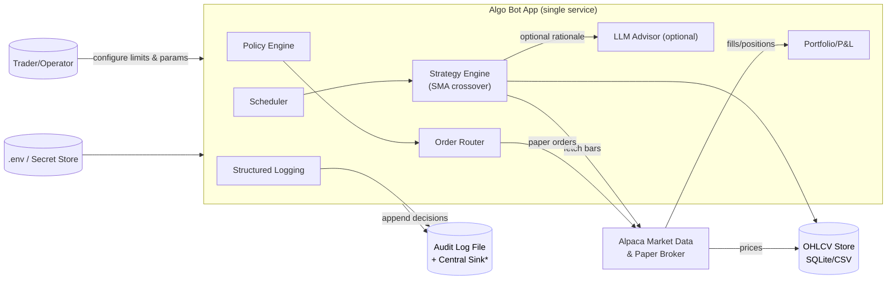
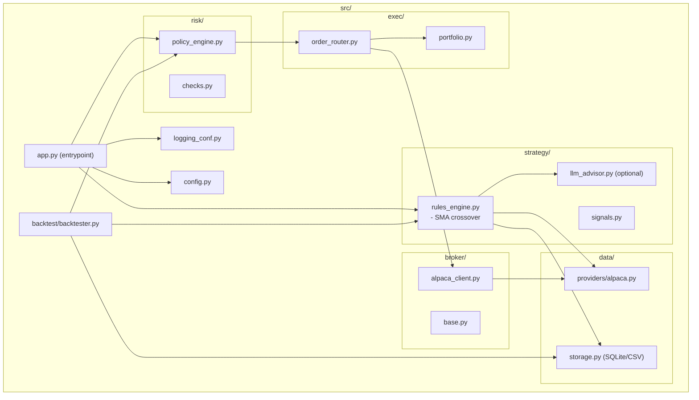
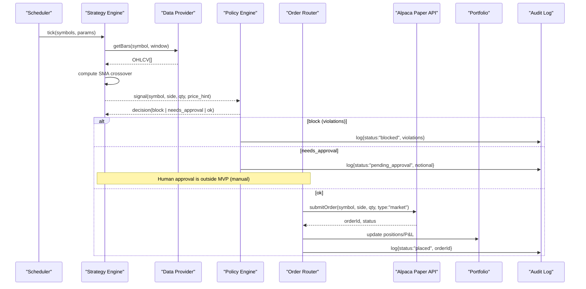
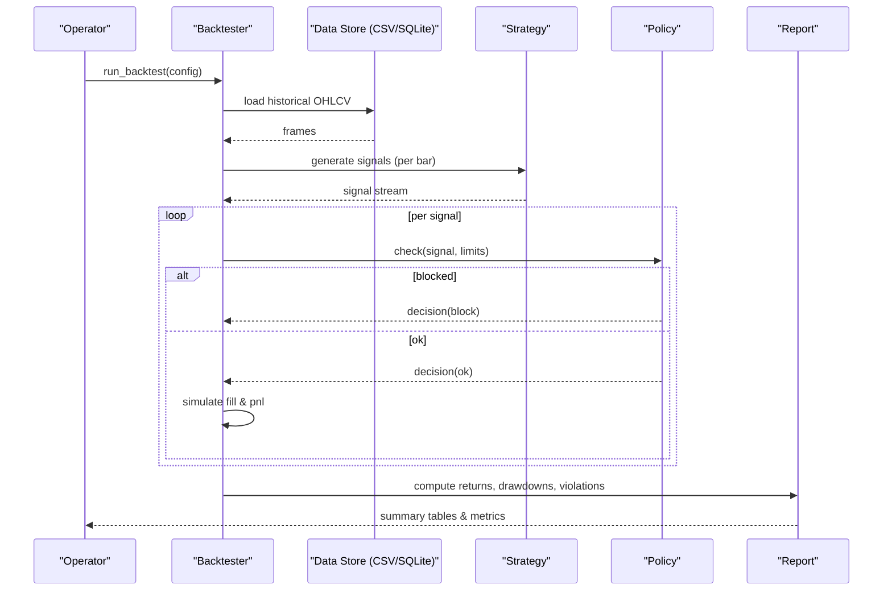
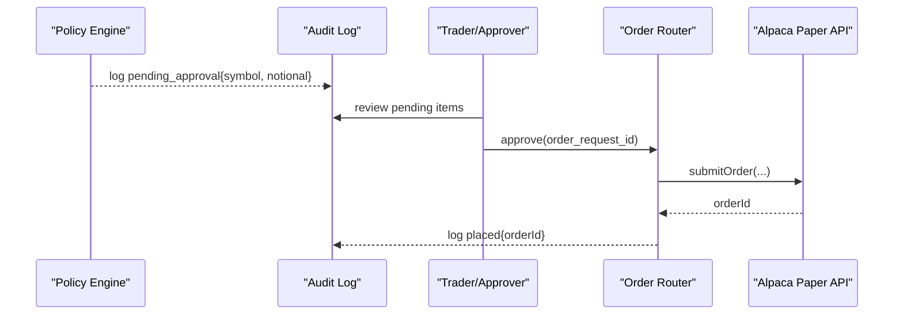

# Architecture — Algo Trading Bot MVP

This document complements the PRD with **component contracts**, **config schemas**, and **Mermaid diagrams** (system context, modules, and sequence flows).

> In GitHub, Mermaid renders automatically. In VS Code, use a Mermaid extension to preview.

---

## 1) System Context Diagram (MVP)



---

## 2) Module / Component Diagram



---

## 3) Sequence Flows

### 3.1 Paper Trading Loop



### 3.2 Backtest Run



### 3.3 (Informational) Manual Approval Path — Post-MVP



---

## 4) Component Contracts (LLM-Friendly)

### 4.1 `strategy/rules_engine.py`
```pseudo
fn generate_signal(symbol: str, ohlcv: Frame, params: SMAParams) -> Optional[Signal]
 inputs:
   - symbol: ticker
   - ohlcv: dataframe with columns [timestamp, open, high, low, close, volume]
   - params: {fast:int, slow:int, min_volume:int}
 outputs:
   - Signal {symbol, side: "buy"|"sell", qty: float, price_hint: float, reason: str}
 behavior:
   - compute SMA_fast and SMA_slow
   - if crossover up -> buy; down -> sell; else None
   - qty sizing: fixed-dollar / price_hint rounded
```

### 4.2 `strategy/llm_advisor.py` (optional)
```pseudo
fn advise(context: MarketContext) -> AdvisoryNote
 inputs: {symbol, recent_change_pct, macro_note?}
 outputs: {rationale: str, confidence: float [0..1]}
 note: advisory only; never returns orders
```

### 4.3 `risk/policy_engine.py`
```pseudo
fn check_order(signal: Signal, limits: Limits, day_pl: float) -> Decision
 inputs:
   - signal: {symbol, side, qty, price_hint}
   - limits: {max_symbol_notional, max_gross_notional, daily_max_drawdown, approval_threshold}
   - day_pl: realized + unrealized P&L today
 outputs: Decision {status: "blocked"|"needs_approval"|"ok", violations: [...], notional: float}
 rules:
   - notional = qty * price_hint
   - apply hard caps; if day_pl < -daily_max_drawdown -> blocked
```

### 4.4 `exec/order_router.py`
```pseudo
fn execute(decision: Decision, signal: Signal) -> ExecResult
 if decision.status == "ok":
   - call broker.place_order(symbol, side, qty, type="market", tif="day")
   - return {status:"placed", order_id}
 elif decision.status == "needs_approval":
   - persist pending; return {status:"pending"}
 else:
   - return {status:"blocked", violations}
```

### 4.5 `broker/alpaca_client.py`
```pseudo
class AlpacaClient:
  fn get_bars(symbol: str, tf: str, limit:int) -> Frame
  fn submit_order(symbol:str, side:str, qty:float, type:str, time_in_force:str) -> Order
  fn get_account() -> Account
```

### 4.6 `backtest/backtester.py`
```pseudo
fn run(config: BacktestConfig) -> BacktestReport
 steps:
  - load OHLCV from CSV/SQLite for symbols & date range
  - iterate bars -> generate_signal -> policy check -> simulate fills
  - compute metrics: CAGR, Sharpe (naive), max DD, winrate
  - return report + CSV of equity curve
```

---

## 5) Config Schemas and Logging

### `.env`
```
ENV=dev
ALPACA_KEY_ID=...
ALPACA_SECRET_KEY=...
ALPACA_BASE_URL=https://paper-api.alpaca.markets
SYMBOLS=AAPL,MSFT,SPY
SCHEDULE_CRON=*/5 * * * *
MAX_POSITION_PER_SYMBOL=10000
MAX_GROSS_NOTIONAL=50000
DAILY_MAX_DRAWDOWN=1000
REQUIRE_HUMAN_APPROVAL_OVER=2500
STRAT_SMA_FAST=20
STRAT_SMA_SLOW=50
MIN_VOLUME=100000
DATABASE_URL=sqlite:///./state.db
```

### Structured Log Example
```json
{
  "ts": "2025-08-15T10:03:21Z",
  "component": "policy",
  "event": "decision",
  "symbol": "AAPL",
  "side": "buy",
  "qty": 10,
  "price_hint": 195.2,
  "notional": 1952.0,
  "status": "ok",
  "violations": []
}
```
