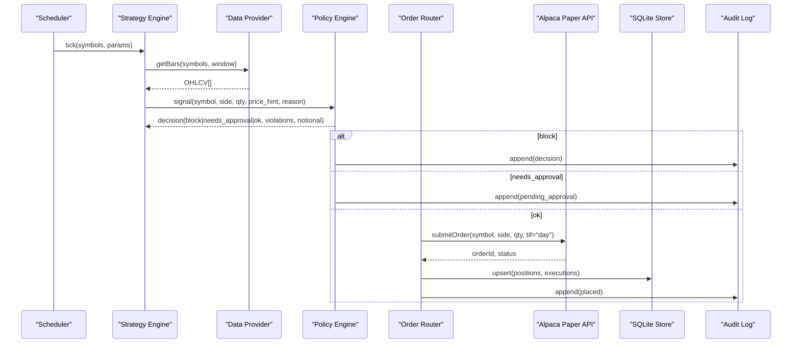

# Technical Design Document — Algo Trading Bot MVP

This document translates the PRD and Architecture into an implementable design with **data models**, **interfaces**, and **operational details**. All Mermaid entities with spaces/special characters are quoted for compatibility.

---

## 1. Overview & Objectives
- Build a single-service MVP that performs **paper trading** via Alpaca with strict **risk guardrails** and full **auditability**.
- Provide **strategy hooks** (SMA crossover), a **Policy Engine**, a minimal **Backtester**, and **structured logging**.
- Storage: local **SQLite** for state + optional CSVs for OHLCV and reports.
- Deploy via Docker Compose; config via `.env` and (optional) `config.yaml`.

---

## 2. Assumptions & Constraints
- Market and order routing via **Alpaca Paper API**.
- Time granularity: minute or daily bars; MVP examples use **daily**.
- Idempotency and fail-closed behavior: never place orders if Policy fails or broker is unavailable.
- SQLite is single-writer; orchestrator runs **one trading loop at a time**.

---

## 3. High-Level Flow (Mermaid)


---

## 4. Data Model (SQLite)
### 4.1 Schema Overview
- **ohlcv**: optional cache of market bars for backtest/run caching.
- **orders**: intent-level records created prior to submission (for idempotency).
- **executions**: broker-side accepted orders/fills.
- **positions**: per-symbol running position state.
- **pnl_snapshots**: point-in-time P&L for reporting.
- **approvals_pending**: items requiring human approval (post-MVP manual).
- **audit_log**: append-only structured events.
- **locks**: singleton row to ensure only one live loop is active.

### 4.2 SQL DDL
```sql
-- ohlcv: cached bars
CREATE TABLE IF NOT EXISTS ohlcv (
  symbol TEXT NOT NULL,
  ts INTEGER NOT NULL,         -- epoch millis UTC
  open REAL NOT NULL,
  high REAL NOT NULL,
  low REAL NOT NULL,
  close REAL NOT NULL,
  volume INTEGER NOT NULL,
  PRIMARY KEY(symbol, ts)
);

-- orders: local intent + idempotency
CREATE TABLE IF NOT EXISTS orders (
  id TEXT PRIMARY KEY,           -- UUIDv4 or hash(idempotency_key)
  created_ts INTEGER NOT NULL,
  symbol TEXT NOT NULL,
  side TEXT CHECK(side IN ('buy','sell')) NOT NULL,
  qty REAL NOT NULL,
  price_hint REAL,
  notional REAL,
  status TEXT CHECK(status IN ('created','submitted','rejected','canceled','filled','partial')) NOT NULL,
  idempotency_key TEXT UNIQUE NOT NULL,
  reason TEXT,
  policy_decision TEXT,          -- 'ok'|'blocked'|'needs_approval'
  policy_violations TEXT         -- JSON array
);

-- executions: broker-facing state
CREATE TABLE IF NOT EXISTS executions (
  id TEXT PRIMARY KEY,           -- local UUID
  order_id TEXT NOT NULL REFERENCES orders(id),
  broker_order_id TEXT,          -- from Alpaca
  ts INTEGER NOT NULL,
  symbol TEXT NOT NULL,
  side TEXT CHECK(side IN ('buy','sell')) NOT NULL,
  qty REAL NOT NULL,
  price REAL,
  status TEXT CHECK(status IN ('submitted','accepted','partially_filled','filled','rejected','canceled')) NOT NULL,
  raw JSON
);

-- positions: per-symbol running position
CREATE TABLE IF NOT EXISTS positions (
  symbol TEXT PRIMARY KEY,
  qty REAL NOT NULL,
  avg_cost REAL NOT NULL,
  updated_ts INTEGER NOT NULL
);

-- pnl snapshots: daily or per-run
CREATE TABLE IF NOT EXISTS pnl_snapshots (
  ts INTEGER NOT NULL,
  symbol TEXT NOT NULL,
  position_qty REAL NOT NULL,
  avg_cost REAL NOT NULL,
  unrealized_pl REAL NOT NULL,
  realized_pl REAL NOT NULL,
  PRIMARY KEY(ts, symbol)
);

-- approvals pending (manual; post-MVP behavior)
CREATE TABLE IF NOT EXISTS approvals_pending (
  id TEXT PRIMARY KEY,
  created_ts INTEGER NOT NULL,
  symbol TEXT NOT NULL,
  side TEXT NOT NULL,
  qty REAL NOT NULL,
  price_hint REAL,
  notional REAL NOT NULL,
  reason TEXT
);

-- audit log (append-only)
CREATE TABLE IF NOT EXISTS audit_log (
  id INTEGER PRIMARY KEY AUTOINCREMENT,
  ts INTEGER NOT NULL,
  component TEXT NOT NULL,
  event TEXT NOT NULL,
  payload JSON NOT NULL
);

-- singleton lock to prevent concurrent live loops
CREATE TABLE IF NOT EXISTS locks (
  name TEXT PRIMARY KEY,
  holder TEXT,
  updated_ts INTEGER
);
```

### 4.3 Indexing
- `ohlcv(symbol, ts)` primary key supports range scans.
- `orders(idempotency_key)` UNIQUE to prevent dup submits.
- `executions(order_id)` implicit via FK; add index if volume increases.

---

## 5. Core Algorithms
### 5.1 Strategy: SMA Crossover
1. Compute `SMA_fast` and `SMA_slow` over close prices.
2. Generate **buy** signal on upward crossover; **sell** on downward crossover.
3. Quantity sizing: `target_notional / price_hint` rounded down to broker lot rules (equities: share precision = 1).

### 5.2 Policy Engine
- Compute `notional = qty * price_hint`.
- Check against limits:
  - `max_symbol_notional` (per symbol)
  - `max_gross_notional` (sum across open intents + positions)
  - `daily_max_drawdown` (block if P&L for day below threshold)
  - `approval_threshold` (mark as `needs_approval`)
- Return: `Decision{status, violations[], notional}`.

### 5.3 Order Router & Idempotency
- Build `idempotency_key = sha256(symbol|side|qty|time_bucket)`; store in `orders`.
- If a key exists with terminal state, **do not** resubmit.
- Submit order to broker; on 429/5xx, retry with exponential backoff (jitter) and **single-flight** lock.

---

## 6. Interfaces (Python-level Contracts)
```text
strategy.generate_signal(symbol, frame, params) -> Optional[Signal]
risk.check_order(signal, limits, day_pl) -> Decision
broker.place_order(symbol, side, qty, type='market', time_in_force='day') -> Order
exec.route_market_order(signal, decision) -> ExecResult
backtest.run(config) -> BacktestReport
```

---

## 7. Configuration
### 7.1 `.env`
```
ENV=dev
ALPACA_KEY_ID=...
ALPACA_SECRET_KEY=...
ALPACA_BASE_URL=https://paper-api.alpaca.markets
SYMBOLS=AAPL,MSFT,SPY
SCHEDULE_CRON=*/5 * * * *
MAX_POSITION_PER_SYMBOL=10000
MAX_GROSS_NOTIONAL=50000
DAILY_MAX_DRAWDOWN=1000
REQUIRE_HUMAN_APPROVAL_OVER=2500
STRAT_SMA_FAST=20
STRAT_SMA_SLOW=50
MIN_VOLUME=100000
DATABASE_URL=sqlite:///./state.db
```

### 7.2 YAML (optional)
```yaml
symbols: [AAPL, MSFT, SPY]
schedule: "*/5 * * * *"
limits:
  max_symbol_notional: 10000
  max_gross_notional: 50000
  daily_max_drawdown: 1000
  approval_threshold: 2500
strategy:
  name: sma_crossover
  params:
    fast: 20
    slow: 50
    min_volume: 100000
```

---

## 8. Observability & Audit
### 8.1 JSON Log Envelope
```json
{"ts":"2025-08-18T16:00:00Z","component":"policy","event":"decision","symbol":"AAPL","side":"buy","qty":10,"price_hint":195.2,"notional":1952.0,"status":"ok","violations":[]}
```

### 8.2 Audit Events (CSV)
```
ts,component,event,symbol,side,qty,price_or_hint,notional,status,details
2025-08-18T16:00:00Z,policy,decision,AAPL,buy,10,195.2,1952,ok,{}
```

---

## 9. Concurrency & Reliability
- Acquire process-level lock via `locks` table row `name = 'live_trading'`.
- Use SQLite **IMMEDIATE** transactions around order writes.
- Retries: 3 attempts, backoff with jitter (250ms base -> 2s max).
- Timeouts: broker HTTP 5s connect, 10s read; overall 15s.

---

## 10. Testing Plan
- **Unit**: strategy signals, policy limits, idempotency collision.
- **Integration**: Alpaca sandbox order placement; verify state tables updated.
- **Backtests**: load deterministic CSV; assert metric thresholds.
- **Chaos**: simulate broker 5xx/429; ensure fail-closed and no dup orders.

---

## 11. Security & Secrets
- Secrets from environment; no plaintext in repo.
- Least privilege on broker API keys; paper-only in MVP.
- Redact secrets in logs; structured logs avoid dumping env.

---

## 12. Open Questions / Future Work
- Approval workflow channel (Slack/email) and persistence model.
- Multi-broker abstraction and broker capability matrix.
- Portfolio optimization and multi-asset support.
- Prometheus/Grafana metrics emitter.
- Migration from SQLite to Postgres when needed.
